## 🔐 Test Accounts
# Final Laravel E-Commerce Web App

## Screenshots

Index
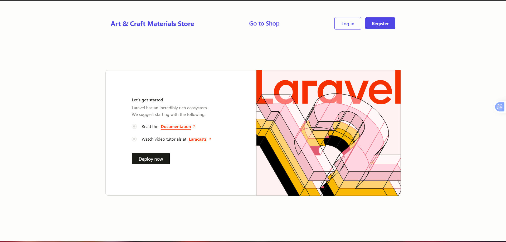

Login
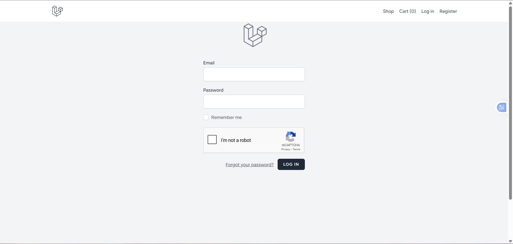

Register
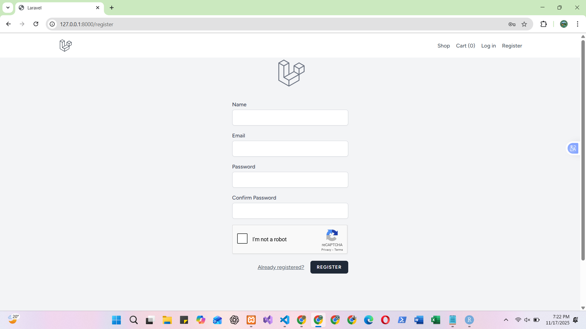

Shop
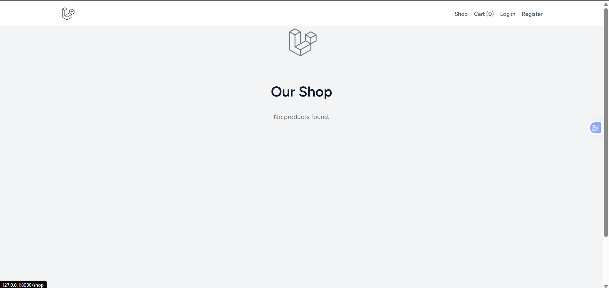

Admin Dashboard
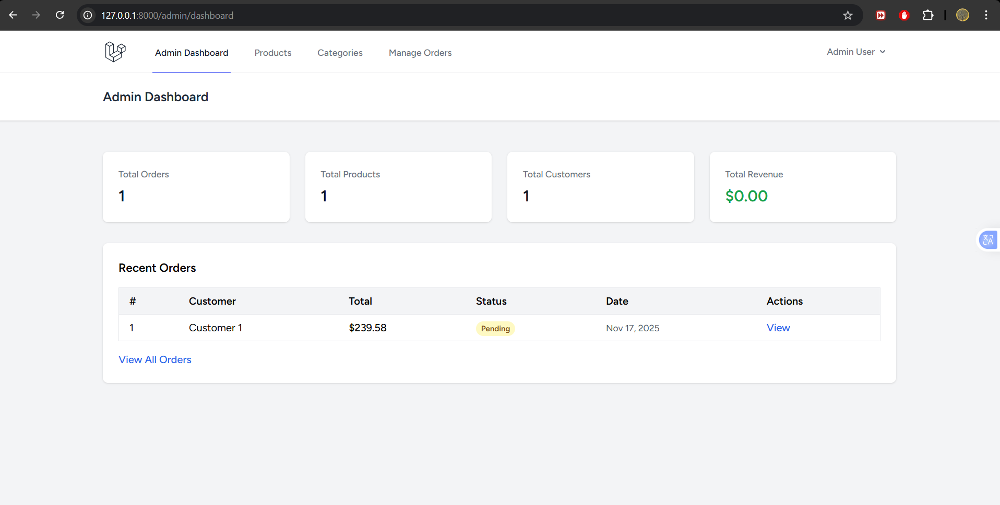

Admin Category
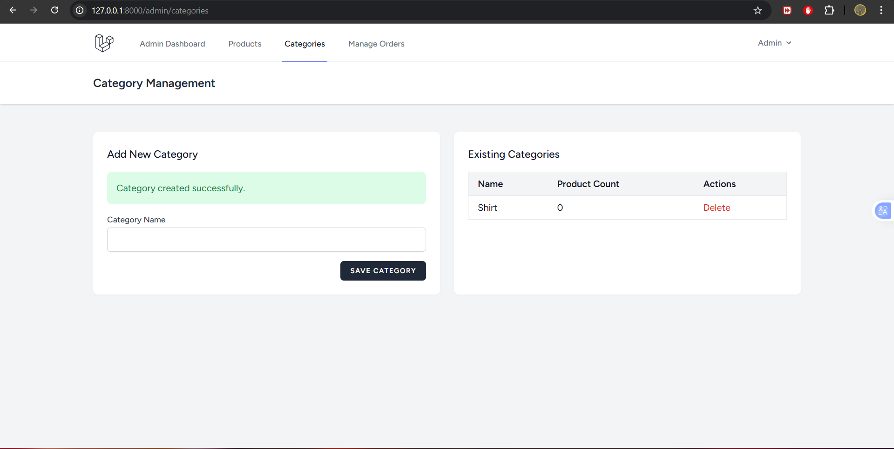

Admin Order List
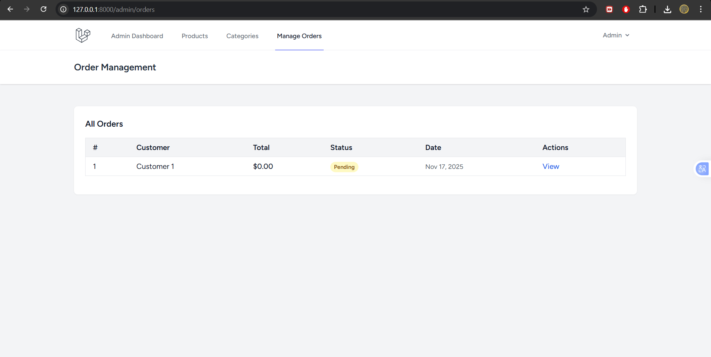

Admin Order View

Customer Cart
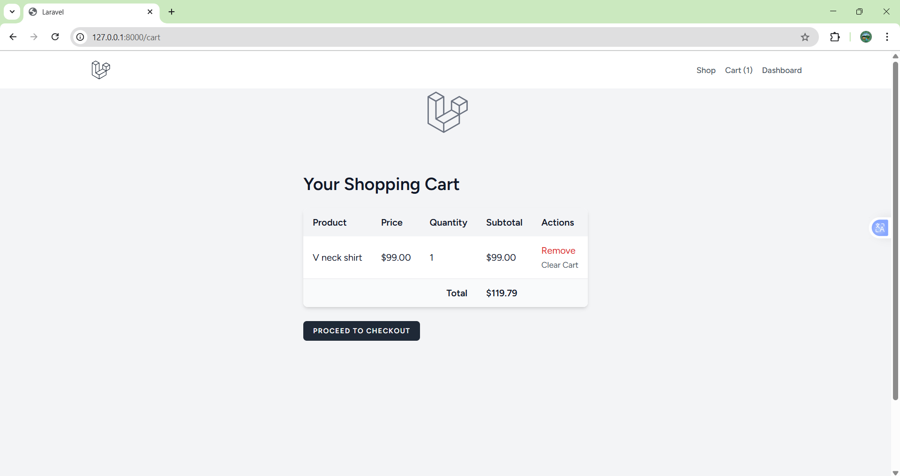

Customer Checkout

Customer Dashboard
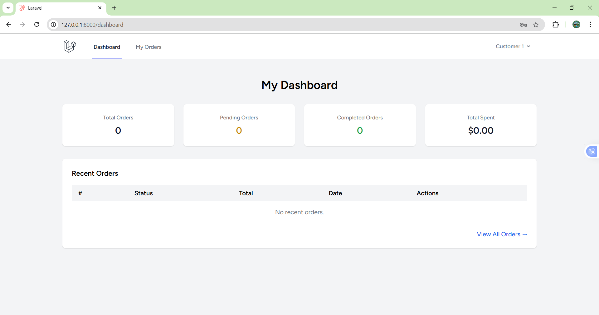

Customer Dashboard With Order
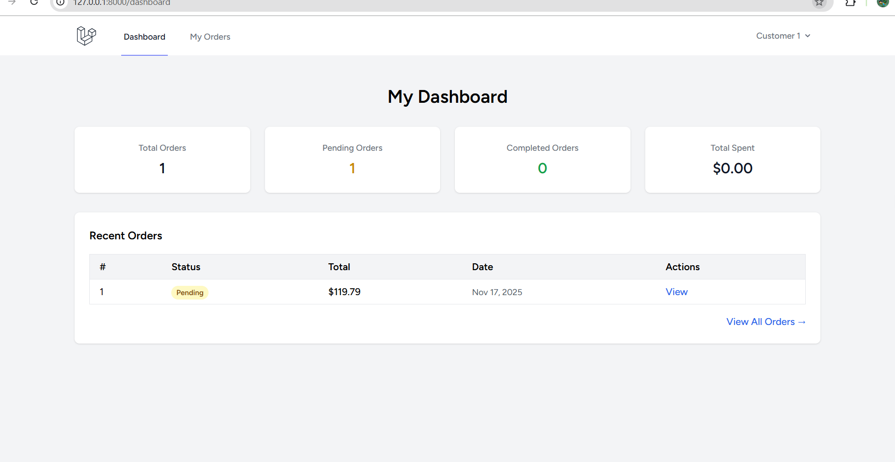

Customer View Order
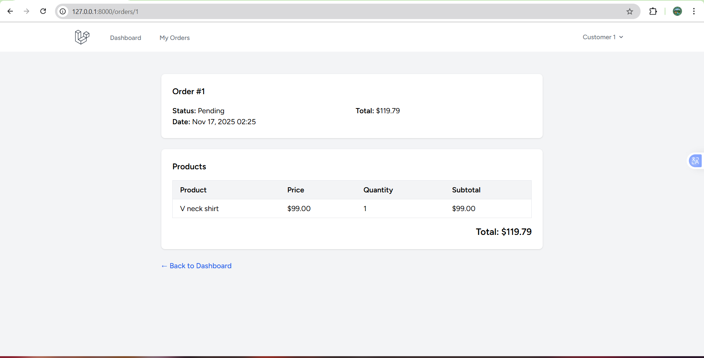

### 🛠️ Admin Account
Use this account to access the admin dashboard.

**Email:** admin@gmail.com
**Password:** Admin1234

---

### 👤 Customer Account
Use this account to test normal user features.

**Email:** customer1@gmail.com
**Password:** Customer1234
# EcommerceLaravelWebApp
